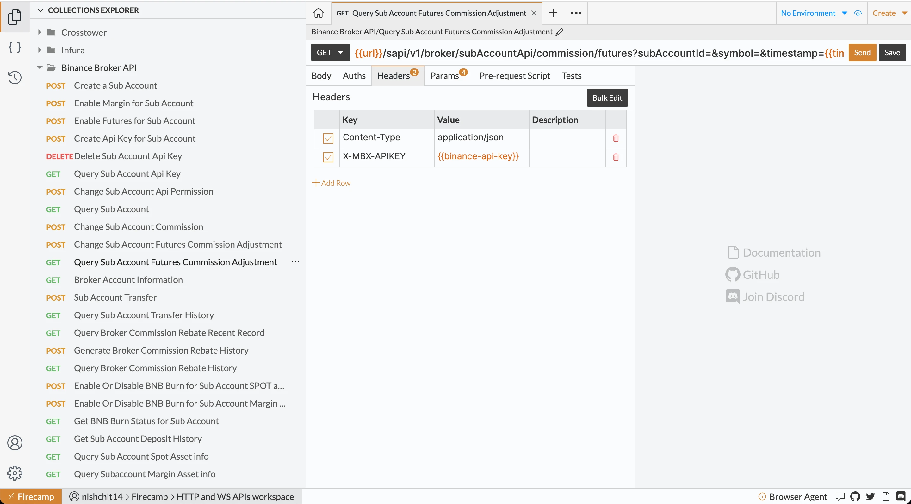

import { Bleed } from 'nextra-theme-docs'

# API Collection

## Overview

In Firecamp, a collection refers to a set of saved API requests organized in a structured manner. Collections provide a convenient way to store and manage your frequently used requests, making it easier to reuse, share, and collaborate on API workflows. Within a workspace, collections can be accessed and utilized by all members, enhancing collaboration and productivity.

<Bleed>

</Bleed>

In this documentation, we will explore the functionalities and features of collections in Firecamp. We'll cover how to create, organize, share, export, and import collections to streamline your API development process. Let's get started!

## Creating a Collection
To create a collection in Firecamp, follow these steps:

1. Click on Global Menu (`Create` button at top-right corner)
2. Select `New Collection`
3. Enter the Collection Name
4. Hit Enter or Click on Create button

You will see the newly created Collection in the Explorer Sidebar.

// TODO: Image

## Managing a Collection
In Firecamp, you can perform various actions to manage your collections, such as renaming, deleting, and organizing requests within folders. You can create nested folders to further organize your requests based on different criteria or project structures.

### Renaming a Collection
To rename the collection, follow these steps

1. Click on collection menu 
2. Select `Rename` option
3. Type new name for the collection
4. Hit enter to change

// TODO: Image

### Deleting a Collection
To delete the collection, follow these steps

1. Click on collection menu 
2. Select `Delete` option
3. You'll be asked to confirm the delete action
4. Click on `Yes, delete it.` button to confirm.

### Sharing a Collection

#### Sharing Within the Workspace
When you create a collection within a workspace, all members of that workspace can access and work with the collection by default. This allows for efficient teamwork and knowledge sharing, as everyone within the workspace can leverage the saved requests and benefit from the collective effort.

#### Sharing Outside of the Workspace
If you need to share a collection with someone outside of the workspace, Firecamp provides an easy way to do so. You can export the collection and share the exported file with the intended recipient. They can then import the collection into their Firecamp instance, making it accessible to them.

##### Export the Collection
To export a collection, follow these steps:

1. Open the collection menu you want to share.
2. Click on the "Export" button.
3. Save the exported file to your local system.

// TODO: Image

##### Import the Collection
To import a collection follow these steps:

1. Open their Firecamp instance.
2. Click on the "Import" button from the Home tab.
3. Select the exported collection file.

// TODO: Image